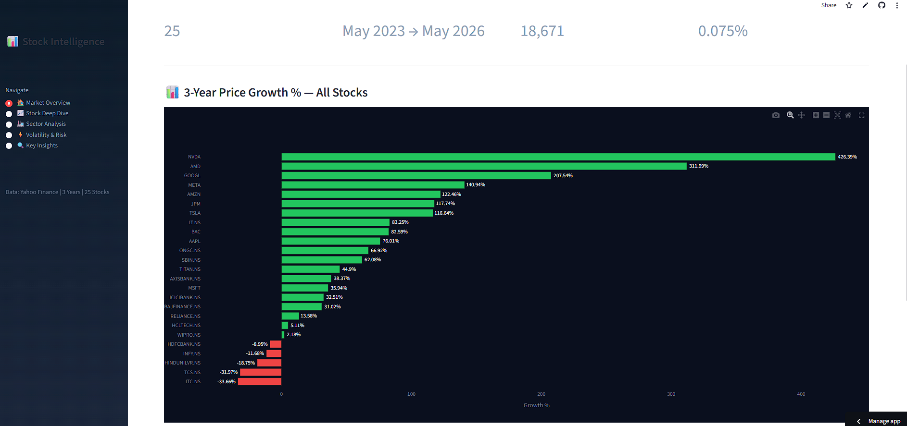
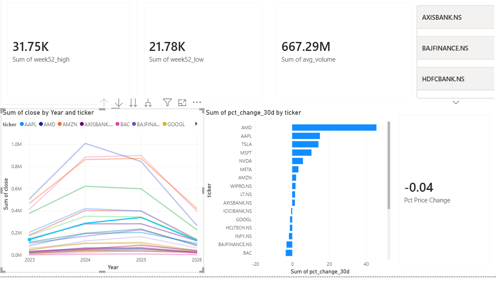
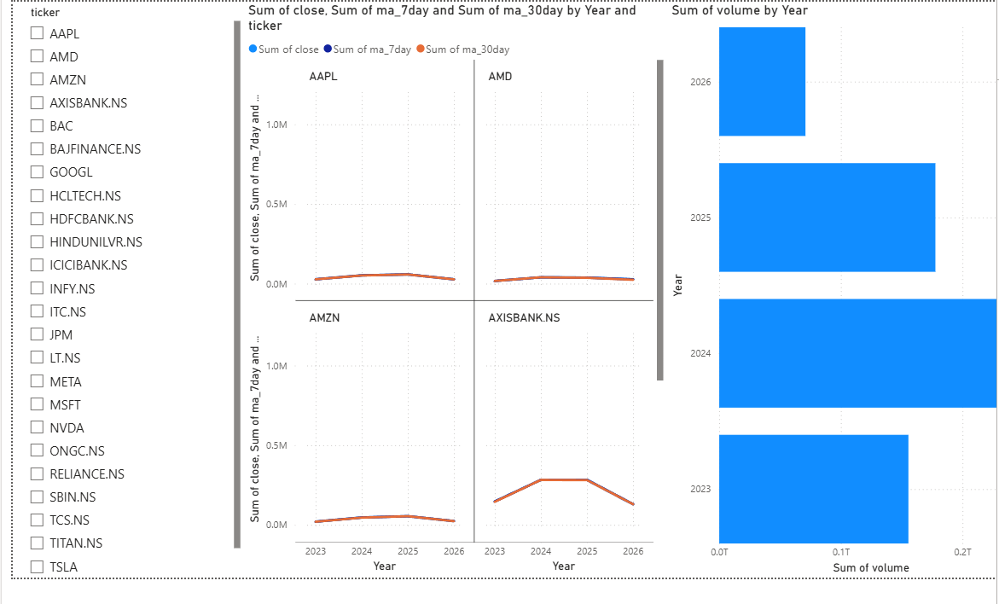
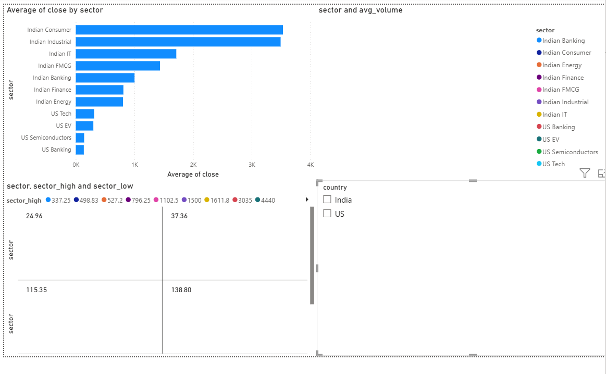

# Stock Market Analytics — BI Dashboard

---

I built this project to understand how modern analytics pipelines actually work — not just the dashboards at the end, but everything underneath them.

It pulls three years of daily stock data across 25 Indian and US stocks, moves it through a proper ETL pipeline into DuckDB, transforms it with dbt into a star schema, runs statistical tests on sector returns, and delivers the results through three separate dashboards.

The questions I was trying to answer were simple: which stocks are actually risky, which sectors consistently outperform, and are those differences real or just noise in the data?

---

## What I found

- US Tech outperforms Indian IT with statistical significance — p-value 0.004, confirmed by a Welch's t-test on 8,000+ trading days
- TSLA and AMD carry the most risk — 57% and 55% annualised volatility
- ICICI Bank is the most stable stock in the entire dataset
- Indian banking is roughly 4x more stable than US tech on a volatility basis
- NVDA delivered 426% growth but at 47% annual volatility — the classic high risk, high reward tradeoff
- AMZN and NVDA move almost identically with a 0.94 correlation

---

## How it works

yFinance API → Python ETL → DuckDB star schema → dbt transformation layer → Power BI / Tableau / Streamlit

---

## Data model

I modelled everything into a star schema — fact_stock_prices at the centre with 18,671 rows of daily OHLCV data, with dim_stock and dim_date hanging off it as dimension tables.

The dbt layer sits on top of DuckDB and handles all the transformation logic. Two staging models clean the raw tables and add derived columns like daily price change and market labels. Two mart models then aggregate up to per-ticker and per-sector level, computing annual volatility, average returns, and total volume.

12 dbt tests run across both layers on every push via GitHub Actions.

---

## A/B testing

I wanted to know whether sector return differences were actually meaningful or just noise, so I ran Welch's independent samples t-test at α = 0.05 across three comparisons.

| Test | Mean A | Mean B | p-value | Significant |
|---|---|---|---|---|
| US Tech vs Indian IT | +0.045% | -0.054% | 0.0043 | Yes |
| Tech vs Other | +0.045% | -0.018% | 0.0369 | Yes |
| Indian IT vs Banking | -0.054% | +0.001% | 0.0997 | No |

US Tech genuinely outperforms Indian IT — that difference holds up statistically. The IT vs Banking gap looks meaningful in the averages but doesn't clear the significance threshold.

---

## Dashboards

**Streamlit** — live interactive dashboard with sector filters and stock deep-dive charts.

**Power BI** — three-page report covering market overview, stock deep-dive, and sector analysis.

**Tableau Public** — four-sheet dashboard covering sector returns, price trends, volatility by sector, and top stocks by volume.
View it here: https://public.tableau.com/app/profile/saithrisha.daggupati/viz/StockMarketAnalytics_17805669868700/StockMarketAnalytics

---

## BigQuery migration

The project includes a ready-to-run migration script at src/migrate_to_bigquery.py that exports both DuckDB tables to BigQuery using pandas-gbq. If you have a GCP project set up, the instructions are in the script comments.

---

## Built with

Python · Pandas · yFinance · DuckDB · dbt · Power BI · Tableau · Streamlit · Plotly · Scipy

---

## Run it

git clone https://github.com/saithrishadaggupati/stock-market-analytics
cd stock-market-analytics
pip install -r requirements.txt
python src/fetch_stock.py
python src/migrate_to_duckdb.py
python src/kpi_queries.py
python src/statistics_analysis.py
python src/ab_testing.py
streamlit run dashboard/app.py

Open stock_market_bi.pbix in Power BI Desktop for the Power BI report.
Open Tableau workbook or visit the Tableau Public link above for the Tableau dashboard.